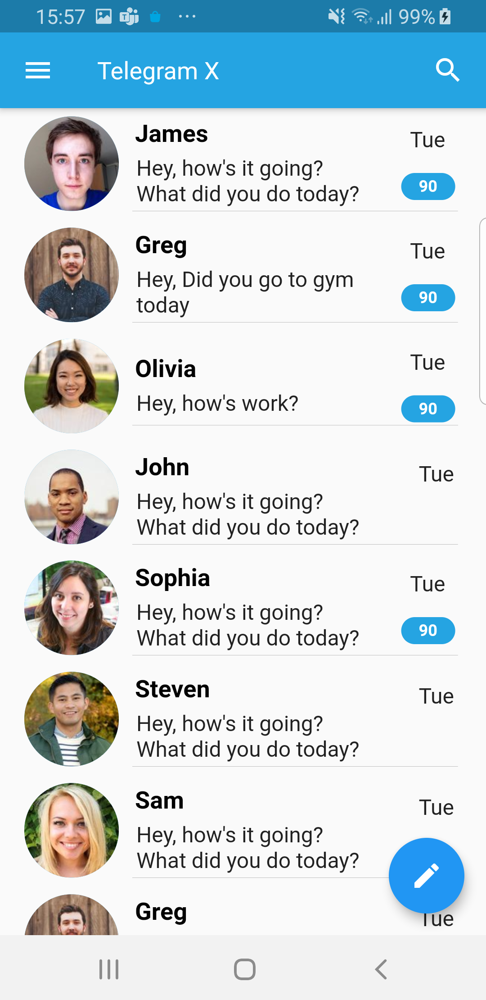
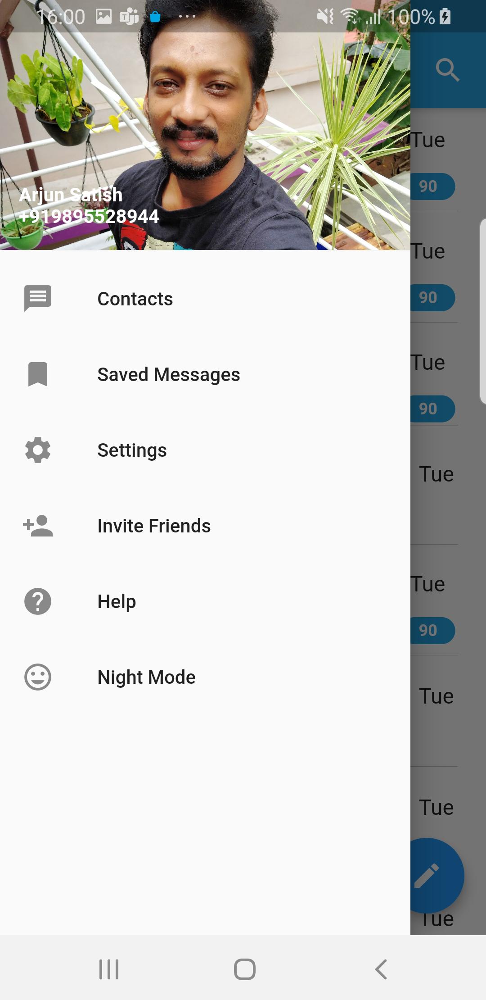
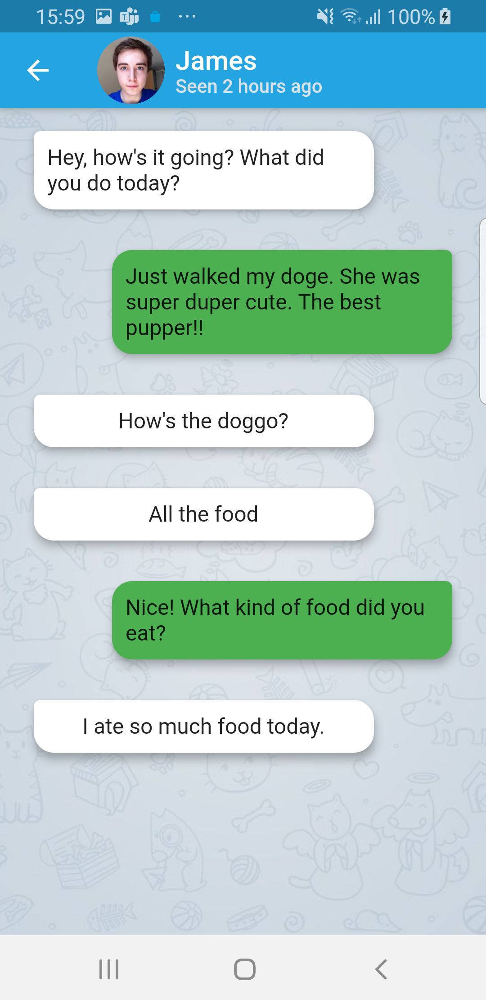

# Telegram X Clone written in Flutter

Intention of this project is to create a TelegramX clone in Flutter. For the initial phase only the 2 major screens are created and that too with local data and add more feature over the course of time.

This project is a work in progress and I am taking baby steps in Flutter, so please feel to reach out to me if there are issues and expecting good PR's is always welcome

Home Screen                |  Side Menu                      |   Chat Detail Screen
:-------------------------:|:-------------------------------:|:---------------------------------:
  |    |

